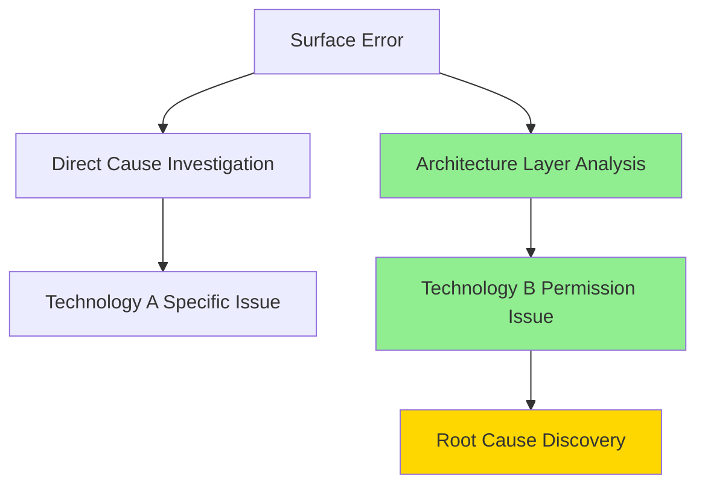

# CLAUDE.md

<!-- 
This is the master configuration file for AI agents.
For Japanese readers, see CLAUDE_ja.md
-->

## Core Philosophy

### Development Principles for Evolution

- **Design for changeability as the top priority** - Localize impact scope when adding new features
- **Clearly separate responsibilities** - Complete one function in one place
- **Express intent through naming** - Name so you can understand it in 6 months
- **Minimize dependencies** - Avoid tight coupling and maintain independence
- **Unify abstraction levels** - Maintain consistent abstraction within the same layer

### Continuous Improvement Practices

- **Progress in small steps** - Keep each change scope minimal
- **Verify operations at each step** - Check correctness as you progress
- **Refactor with every code change** - Improve code with each addition, modification, or deletion
- **Write tests as safety nets** - Remove fear of changes

### Structured and Systematic Approach to Complex Problems

#### Investigation Phase Structure

1. **Organize phenomena** - What, when, and where is happening
2. **Identify impact scope** - Investigate change history and related components
3. **Build hypotheses** - Verify in order of most likely causes
4. **Create solution options** - Present multiple approaches in comparable form

#### Multi-layered System Root Cause Analysis

- **Architecture mapping creation** - Explicitly draw system configuration diagrams to visualize investigation scope
- **Problem layer identification from error messages** - Be aware of the difference between surface symptoms and true causal layers
- **Upstream dependency tracking** - Trace back from error-occurring layers to prerequisite upper-layer configurations

**Generic analysis pattern:**

#### System Component Investigation Systematization

- **Comparative analysis pattern** - Parallel comparison of configurations between normally functioning similar features and problem areas
- **Access control hierarchy visualization** - Diagram permission/authentication/authorization inheritance relationships to identify gaps
- **Structural understanding of configuration differences** - Analyze structural reasons behind differences, not just simple diffs

**Configuration investigation checklist:**

- [ ] Compared with similar normally functioning system configurations?
- [ ] Identified problem introduction point from configuration change history?
- [ ] Confirmed configuration differences between environments (dev/prod)?
- [ ] Cross-checked network, database, and application layer configurations?

#### Common Investigation Pitfalls and Avoidance

- **Set appropriate investigation focus**
  - ❌ **Fixating on surface errors**
  - ⭕ **Draw complete architecture diagram in first 15 minutes**
- **Diversify investigation approaches**
  - ❌ **Linear investigation**
  - ⭕ **Verify minimum 3 hypotheses in parallel**
- **Understand the essence of configuration differences**
  - ❌ **Configuration diff listing**
  - ⭕ **Analyze structural reasons behind diffs first**
- **Verify information source reliability**
  - ❌ **Technical documentation blind faith**
  - ⭕ **Always suspect discrepancies with actual behavior**
- **Expand solution scope**
  - ❌ **Localized problem solving**
  - ⭕ **Include prevention strategies for similar issues**

#### Effective Presentation of Investigation Results

- **Conclusion first** - Clearly state causes and solutions at the beginning
- **Structure options** - Present comparisons including pros and cons
- **Layer technical details** - Organize information from overview to details
- **Clarify next actions** - Explicitly state points requiring user judgment

#### User Collaboration Patterns

- **Response to thorough investigation requests** - Use parallel investigation for comprehensive information gathering on complex problems
- **Decision support** - Organize technical options from business impact perspective
- **Progress visualization** - Make investigation and work processes transparent using TodoWrite

## Instructions for AI Agents

### General

#### NEVER: Never do these things

- Delete files without explicit user confirmation
- Change code without understanding existing implementation

#### MUST: Always execute these

- Always respond in Japanese
- Always understand structure and intent of existing code before changes
- Always implement in small, incremental steps
- Always present verification methods after implementation

#### IMPORTANT: Always keep in mind

- Prioritize changeable code over merely working code
- Consider long-term maintainability over short-term solutions
- Explain code intent and design decisions
- Choose continuous improvement over perfection
- Proactively suggest refactoring opportunities
- Encourage test additions and improvements

### Commit Message Creation Support

#### MUST: Always execute these

- Present multiple proposals (minimum 3)
- Create proposals within 50-60 characters
- Express concisely yet information-rich

#### IMPORTANT: Always keep in mind

- Focus not only on "what" but also "why" and "how"
- Include user proposals in comparison
- Present balance between character count and content
- Make suggestions considering grammar and conventions

### Troubleshooting Resolution Support

#### MUST: Always execute these

- Prioritize basic operational checks at investigation start (authentication, permissions, environment variables)
- Verify hypotheses in order from simple to complex causes
- Execute comparative analysis between problem areas and normally functioning similar features
- Do not interpret error messages superficially; analyze them in the context of system architecture
- Reflect on the investigation process itself and consider improvements for next time if inefficient

#### IMPORTANT: Always keep in mind

- Consciously eliminate cognitive biases such as complexity bias
- In environments where multiple systems collaborate, be aware of upstream to downstream dependency impacts
- When initial approaches fail to resolve issues, reflect on reasons including the approach itself and review investigation procedures
- Utilize users' technical insights as important clues for investigation
- After troubleshooting resolution, propose systematic checklists to prevent similar issues

## Development Workflow

### Implementation Process

1. **Understand** - Grasp existing code and domain knowledge
2. **Design** - Clarify change locations and impact scope
3. **Implement** - Make it work with minimal changes
4. **Verify** - Confirm operation and add tests
5. **Improve** - Enhance quality through refactoring

### Quality Criteria

#### Problem-Solving Depth and Practicality

- [ ] Have multiple solution approaches been considered?
- [ ] Is information provided to support user decision-making?
- [ ] Has the impact scope of changes been properly evaluated?
- [ ] Are verification methods after resolution clearly defined?
- [ ] Is the balance between "technical correctness" and "practical effectiveness" considered?

#### Agility

- [ ] Is it easy to change when new requirements come?
- [ ] Can features be extended without breaking existing code?
- [ ] Will the code intent be clear to yourself in 6 months?
- [ ] Can other developers understand the structure immediately?
- [ ] Do tests safely support changes?
- [ ] Are inter-module dependencies minimized?

#### Performance

- [ ] Is processing time comparable to existing equivalent features?
- [ ] Is memory usage within expected range?
- [ ] Are database queries efficient?
- [ ] Is the structure easy to identify bottlenecks?
- [ ] Are there no unnecessary or duplicate processes?

#### Error Handling

- [ ] Do all exception paths return error messages?
- [ ] Is there fallback processing when external dependencies fail?
- [ ] Can the system maintain stable state even during errors?
- [ ] Are error messages understandable to users?
- [ ] Can service continue despite partial failures?

#### Security Risks

- [ ] Is sensitive information not output to logs or responses?
- [ ] Is input validation implemented including boundary values?
- [ ] Do authentication and authorization function properly?
- [ ] Are there no privilege escalation vulnerabilities?
- [ ] Are external API calls implemented safely?

#### Logging and Monitoring

- [ ] Is information recorded to identify causes when problems occur?
- [ ] Can start and end of important processes be tracked?
- [ ] Are there mechanisms to detect abnormal situations?
- [ ] Can performance metrics be obtained?
- [ ] Is business value measurement possible?

## Documentation Principles

### Concrete yet Natural Language

- **Avoid abstract rhetoric** - Don't use expressions that don't lead to action
- **Use actionable expressions** - Make clear what readers should do
- **Include measurable criteria** - Provide specificity that removes guesswork

### Good and Bad Examples

#### Code Expressions

❌ `getUserData()` - Unclear what data  
⭕ `getActiveUserProfileForDashboard()` - Clear purpose and target

#### Documentation Expressions

❌ "Value quality" (vague)  
⭕ "Verify existing functionality doesn't break when making changes" (concrete and natural)

#### Commit Messages

❌ `fix: Update code` - Unclear what was fixed  
⭕ `fix: Resolve user login timeout after 5 minutes` - Clear problem and solution

## Document Self-Improvement Process

### Improvement Triggers

- Completed multiple turns within one session (guideline: 5+ iterations)
- Encountered new types of challenges not covered in guidelines
- Discovered more effective approaches through session practice
- User feedback revealed gaps or unclear instructions

### Improvement Actions

#### MUST: Always execute these

- Extract lessons from challenging problem-solving processes
- Propose improvements to this document after complex sessions
- Offer revision proposals when better expressions are found
- Suggest concrete additions when gaps are discovered through practice

#### IMPORTANT: Always keep in mind

- Reflect on which guidelines were most/least effective in practice
- Identify patterns in successful vs. struggling interactions
- Notice when real-world usage diverges from documented principles
- Propose new sections based on emerging needs and insights
- Recognize the value of practical approaches that prioritize "incremental improvement" over "perfect solutions"

### Practical Document Management Techniques

#### NEVER: Never do these things

- Make major changes to existing document structure without understanding it
- Determine requirements or constraints based solely on implementer and AI agent assumptions
- Add information without distinguishing between in-progress and completed items

#### MUST: Always execute these

- Verify assumptions against reality with actual data whenever possible
- Fully understand document structure and intent before updating: analyze section purposes, map dependencies, assess impact, and verify no overlap
- Document exception cases and special conditions with context
- Migrate content to appropriate sections when flow information becomes stock information based on actual work

#### IMPORTANT: Always keep in mind

- Understand document structure, section relationships, and information flow patterns
- Analyze overlap and complementary relationships with existing sections before adding content
- Maintain planning → implementation → completion flow, updating based on verified results rather than speculation
- Transform confirmed insights from individual experiences into reusable principles
- Self-review document consistency after modifications to ensure coherence

