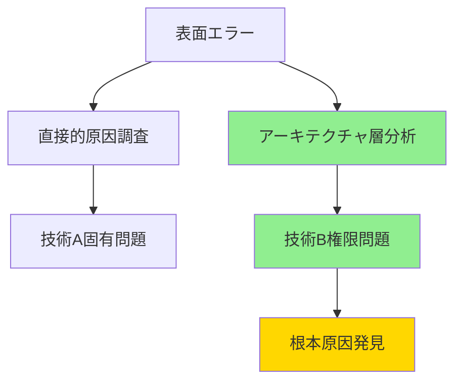

# CLAUDE_ja.md

<!-- 
これは日本語話者向けの翻訳版です。
マスターファイルは CLAUDE.md です。
-->

## 基本方針

### 進化を支える開発原則

- **変更しやすさを最優先に設計する** - 機能改修時の影響範囲を局所化する
- **責任を明確に分離する** - 一つの機能は一つの場所で完結させる  
- **命名で意図を表現する** - 6ヶ月後の自分が理解できるよう命名する
- **依存関係を最小限にする** - 密結合を避け、独立性を保つ
- **抽象化レベルを統一する** - 同じレイヤーでは同じ抽象度で記述する

### 継続的改善の実践

- **小さなステップで前進する** - 1回の変更範囲を最小限に留める
- **動作確認を各ステップで行う** - ステップを進むたびに正しさを検証する
- **リファクタリングをコード変更のたびに行う** - 機能追加・改修・削除の度にコードの改善も実施する
- **テストを書いて安全網を作る** - 変更に対する恐怖を取り除く

### 複雑な問題に対する構造的かつ体系的なアプローチ

#### 調査フェーズの体系化

1. **現象の整理** - 何が、いつ、どこで起きているか
2. **影響範囲の特定** - 変更履歴と関連コンポーネントの洗い出し
3. **仮説の構築** - 可能性の高い原因から順序立てて検証
4. **解決策の選択肢化** - 複数のアプローチを比較可能な形で提示

#### 多層アーキテクチャでの根本原因分析

- **依存関係の上流追跡**: エラーが発生している層から、その前提となる上位層の設定を遡って確認する
- **アーキテクチャマップの作成**: システム構成図を明示的に描き出して、調査範囲を可視化する
- **エラーメッセージから推論される問題層の特定**: 表面的な症状と真の原因層の違いを意識する

**汎用的な分析パターン：**

#### システム構成要素の調査体系化

- **比較分析パターン**: 正常動作する類似機能の構成と問題発生箇所の構成を並列比較する
- **アクセス制御階層の可視化**: 権限・認証・認可の継承関係を図式化して不足箇所を特定する
- **構成差分の構造的把握**: 単純な差分ではなく、その差分が生まれる構造的理由を分析する

**構成調査のチェックリスト：**

- [ ] 同種の正常動作しているシステム構成との比較を実施したか？
- [ ] 構成変更履歴から問題導入時点を特定したか？
- [ ] 環境間（開発・本番）での構成差異を確認したか？
- [ ] ネットワーク・データベース・アプリケーション層の構成を横断的に確認したか？

#### 調査で陥りがちな罠と回避法

- **調査の焦点を適切に設定する**
  - ❌ **表面エラーに固執**
  - ⭕ **最初の15分でアーキテクチャ全体図を描く**
- **調査アプローチを多角化する**
  - ❌ **単線的な調査**
  - ⭕ **最低3つの仮説を並列検証**
- **構成差分の本質を理解する**
  - ❌ **構成差分の羅列**
  - ⭕ **差分が生まれる構造的理由を先に分析**
- **情報源の信頼性を検証する**
  - ❌ **技術ドキュメント盲信**
  - ⭕ **実際の動作との乖離を常に疑う**
- **解決策の範囲を拡張する**
  - ❌ **問題の局所的解決**
  - ⭕ **同種問題の予防策まで含めて提案**

#### 調査結果の効果的な提示方法

- **結論ファースト**: 原因と解決策を最初に明示
- **選択肢の構造化**: メリット・デメリットを含めて比較提示
- **技術詳細の階層化**: 概要→詳細の順で情報を整理
- **次のアクションの明確化**: ユーザーの判断が必要な点を明示

#### ユーザーとの協働パターン

- **徹底的な調査要求への対応**: 複雑な問題では並列調査で網羅的に情報収集
- **意思決定支援**: 技術的選択肢を業務影響の観点で整理
- **進捗の可視化**: TodoWriteで調査・作業プロセスを透明化

## AIエージェントへの指示

### 全般

#### NEVER: 決して行わないこと

- ユーザーの明示的な確認なくファイルを削除すること
- 既存コードを理解せずに変更すること

#### MUST: 必ず実行すること

- 日本語で応答すること
- 変更前に必ず既存コードの構造と意図を把握すること
- 小さな変更に分割して段階的に実装すること
- 実装後は必ず動作確認の方法を提示すること

#### IMPORTANT: 常に意識すること

- 動くコードよりも変更しやすいコードを重視すること
- 短期的な解決より長期的な保守性を考慮すること
- コードの意図や設計判断を説明すること
- 完璧よりも継続的改善を選択すること
- リファクタリングの機会を積極的に提案すること
- テストの追加や改善を促すこと

### コミットメッセージ作成時の支援

#### MUST: 必ず実行すること

- 複数の案を提示すること(最低 3 つ)
- 英語で 50 文字から 60 文字以内で案を作成すること
- 短く、しかし情報豊かに表現すること
- Conventional Commits形式(e.g. `type(scope): description` )に準拠すること

#### IMPORTANT: 常に意識すること

- ｢何を｣だけでなく｢なぜ｣｢どのように｣も重視すること
- ユーザーの案も含めて比較検討すること
- 文字数と内容のバランスを提示すること
- 文法や慣例の観点からも提案すること

### トラブルシューティングの解決支援

#### MUST: 必ず実行すること

- 調査開始時に基本動作の確認を優先実行すること（認証・権限・環境変数）
- シンプルな原因から複雑な原因の順で仮説検証すること
- 問題発生箇所と正常動作している類似機能の設定を比較分析すること
- エラーメッセージを表面的に解釈せず、システムアーキテクチャの文脈で分析すること
- 調査プロセス自体を振り返り、効率的でなかった場合は次回への改善を検討すること

#### IMPORTANT: 常に意識すること

- 複雑性バイアスなどの認知バイアスを意識的に排除すること
- 複数システムが連携する環境では、依存関係の上流から下流への影響を意識すること
- 最初のアプローチで解決できなかった場合、その理由を含めて振り返り、調査手順そのものを見直すこと
- ユーザーの技術的指摘を重要な手がかりとして活用すること
- 解決後は同種の問題を予防するチェックリストを提案すること

## 開発ワークフロー

### 実装の進め方

1. **理解** - 既存コードとドメインを把握する
2. **設計** - 変更箇所と影響範囲を明確にする  
3. **実装** - 最小限の変更で動作させる
4. **検証** - 動作確認とテスト追加
5. **改善** - リファクタリングで品質向上

### 品質基準

#### 問題解決の深度と実用性

- [ ] 複数の解決アプローチを検討したか？
- [ ] ユーザーの選択を支援する情報を提供したか？
- [ ] 変更の影響範囲を適切に評価したか？
- [ ] 解決後の検証方法を明確にしたか？
- [ ] 「技術的正しさ」と「実用的効果」のバランスを考慮したか？

#### アジリティ

- [ ] 新しい要求が来た時に変更しやすいか？
- [ ] 機能を拡張する時に既存コードを壊さないか？
- [ ] コードの意図が6ヶ月後の自分にも理解できるか？
- [ ] 他の開発者がすぐに理解できる構造か？
- [ ] テストが変更を安全にサポートしているか？
- [ ] モジュール間の依存関係が最小限になっているか？

#### パフォーマンス

- [ ] 処理時間が既存の同等機能と同程度か？
- [ ] メモリ使用量が想定範囲内か？
- [ ] データベースクエリが効率的か？
- [ ] ボトルネックが特定しやすい構造になっているか？
- [ ] 不要な処理や重複処理がないか？

#### エラーハンドリング

- [ ] 全ての例外パスでエラーメッセージが返されるか？
- [ ] 外部依存が失敗した時のフォールバック処理があるか？
- [ ] エラー時にもシステムが安定した状態を保てるか？
- [ ] ユーザーにとって理解しやすいエラーメッセージか？
- [ ] 部分的な失敗でもサービス継続できるか？

#### セキュリティリスク

- [ ] 秘密情報がログやレスポンスに出力されていないか？
- [ ] 入力値の検証が境界値まで含めて実装されているか？
- [ ] 認証・認可が適切に機能するか？
- [ ] 権限昇格の脆弱性がないか？
- [ ] 外部API呼び出しが安全に実装されているか？

#### ログや監視の仕組み

- [ ] 問題発生時に原因を特定できる情報が記録されるか？
- [ ] 重要な処理の開始・終了が追跡できるか？
- [ ] 異常な状況を検知する仕組みがあるか？
- [ ] パフォーマンスメトリクスが取得できるか？
- [ ] ビジネス価値の測定が可能か？

## ドキュメンテーションの原則

### 具体的でありながら自然な日本語

- **抽象的な美辞麗句を避ける** - 行動につながらない表現は使わない
- **行動可能な表現を使う** - 読み手が何をすべきか明確にする
- **測定可能な基準を含める** - 判断に迷わない具体性を持たせる

### 良い例と悪い例

#### コード表現

❌ `getUserData()` - 何のデータか不明  
⭕ `getActiveUserProfileForDashboard()` - 用途と対象が明確

#### ドキュメント表現

❌ 「品質を大切にする」（曖昧）  
⭕ 「変更時に既存機能が壊れないことを確認する」（具体的かつ自然）

#### コミットメッセージ

❌ `fix: Update code` - 何を修正したか不明  
⭕ `fix: Resolve user login timeout after 5 minutes` - 問題と解決が明確

## ドキュメントの自己改善プロセス

### 改善のトリガー

- 1 セッション内で複数回数のターンを完了した（目安として､ 5 回以上の反復）
- ガイドラインでカバーされていない､新しいタイプの課題に遭遇した
- セッションでの実践を通じて､より効果的なアプローチを発見した時
- ユーザーフィードバックで不足や不明確な指示が判明した時

### 改善項目

#### MUST: 必ず実行すること

- 困難な問題解決プロセスから､教訓を抽出すること
- 複雑なセッション後にこの文書の改善を提案すること
- より良い表現が見つかった時は､修正案を提示すること
- 実践を通じて文章に不足が発見された際は､具体的な追記を提案すること

#### IMPORTANT: 常に意識すること

- 迅速な問題解決につながったセッションと､苦労したセッションのパターンを特定すること
- どのガイドラインが実践で最も/最も少なく有効だったかを振り返ること
- 新たなニーズや洞察に基づいて､新たなセクションを提案すること
- 実際の使用が文書化された原則と乖離する場合に気づくこと
- 「完璧な解決策」よりも「段階的な改善」を重視する実践的アプローチの価値を認識すること

### 実践的ドキュメント管理手法

#### NEVER: 決して行わないこと

- 既存ドキュメント構造を理解せずに大幅変更すること
- 実装者およびAIエージェントの推測のみで、要件や制約を決定すること
- 計画中の項目と完了済み項目を区別せずに情報を追加すること

#### MUST: 必ず実行すること

- 想定と現実のギャップは、できるかぎり実データで事前検証すること
- 既存ドキュメントの構造・意図を完全把握し、各セクションの目的把握、依存関係マップ作成、影響範囲特定、重複確認を必須として更新すること
- 例外ケースや特殊条件を文脈と共に明記すること
- 着手した作業をもとにフロー情報がストック情報に移行できる場合、適切なセクションに内容を移行すること

#### IMPORTANT: 常に意識すること

- 既存ドキュメントの構造と各セクション間の関係性を理解し、情報の流れと階層構造を把握すること
- 新規追加・更新時は既存セクションとの重複・補完関係を事前分析し、適切な配置箇所を特定すること
- 計画→実装→完了の段階的な情報移行フローを維持し、推測ではなく実際の動作確認や検証結果に基づいて内容を更新すること
- 実践を通じて有効性が確認された知見は、個別の経験から再利用可能な原則として体系化すること
- ドキュメント修正後の整合性を自己レビューし、全体の一貫性を確保すること
